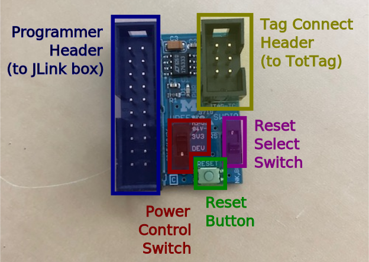

# How to work on TotTag in the Vanderbilt SEA Lab

Hi, we're [Conner](https://www.connerpinson.com/) and Vedant and we had the honor of working with the Vanderbilt SEA Lab in the Spring and Fall 2019 semesters. We wanted to make a place where we can pass down all the knowledge we gathered over the past year (and Conner is obsessed with clean documentation) so we've made this GitHub to help new research assistants understand their role in SEA Lab and the TotTag team around the world.

## Navigating the Totternary GitHub

This is your home. Not a day will go by where you don't think about [this GitHub repository](https://github.com/lab11/totternary).

There are three folders that we, as Vanderbilt SEALab RAs, particularly care about. They are:

```
/software/carrier/apps/node
```
```
/software/module/firmware
```
```
/doc
```

Basically, the [`/software/.../node`](https://github.com/lab11/totternary/tree/master/software/carrier/apps/node) contains the software that needs to be flashed onto the nRF and the [`/software/module/firmware`](https://github.com/lab11/totternary/tree/master/software/module/firmware) contains the software that needs to be flashed onto the STM.

## The Lab11 Tottag Slack

You should have been made a guest member of the Lab11 Slack group in the Tottag channel. The motto here is **ask early, ask often**. I guarantee you if you think it's a dumb question, I asked dumber. And the people in there are more than happy to help with any issue.

Our main helper is Andreas Biri. He is incredibly nice, however, he lives in Switzerland. So expect that, if you ask a question, it will not be answered until 2 or 3 AM. Our workflow was commonly to work until we encounter an issue, send a synopsis to Andreas for the issue, and wait to hear back on next steps.

I'm going to list off the people in the Slack so you can know what to expect from each person.

### External (current or former Lab11 at UC Berkeley)

**Andreas Biri** (PhD @ ETH Zurich) - the lead student on the Totternary project and the main point of contact for debugging. Not a bad idea to `@abiri` in front of each of your debugging messages to make sure he sees it. He is very nice and helpful and not judgemental so please ask him whatever you need!

**Pat Pannuto** (Assistant Professor @ UCSD) - wrote all the nicely detailed documentation in the `/doc` folder. He isn't as available as Andreas but will still chime in when he can.

**Neal Jackson** (PhD @ UC Berkeley) - current student at UCB focusing on low power embeedded devices. He's also working with the TotTags but he mostly chimes in with questions or improvement suggestions.

### Vanderbilt

**Virginia Salo** (post-doc @ SEA Lab) - you should know her. She is your supervisor

**Peter Volgyesi** (Researcher @ ISIS Vanderbilt) - he's worked with the TriPoint ranging system before and made some significant hardware debugs within a week of knowing about TotTag. He is super busy Fall 19 semester but will hopefully be able to be more involved next semester

**Akos Ledeczi** (Researcher @ ISIS Vanderbilt) - point of contact at ISIS. Also super busy will hopefully be able to devote more of his lab resources to use next semester, Spring 20


## Flashing the Devices

Our good friend at Lab11 at UC Berkley [Pat](https://patpannuto.com/) has created a fantastic bit of documentation for exactly what we need to do to work on these devices. You can find flashing instructions at [`/doc/Provisioning.md`](https://github.com/lab11/totternary/blob/master/doc/Provisioning.md) on the Totternary Github. They have some fantastic photos and step-by-step instructions on how to flash the code to the nodes.

**Some notes from Conner:** We have these little "feet" things that look like a green table with three metallic legs. You can use these to keep the cables on the nodes. If you are having trouble making those stick, you can absolutely just hold it (or have a lab friend hold it) and it will flash just fine. Also, if you lose them (we've lost two), you can just hold them on. The terminal will tell you if you aren't making enough of a connection and you can adjust.

See [this video](https://drive.google.com/file/d/1fMS5uLZqrzqTmNVutyW-ul1PJMDI_INk/view?usp=sharing) for a video of Andreas taking the TotTags out of the cases and then putting them back in. This is necessary to flash them.

This next section is taken directly from the [Glossary.md](https://github.com/lab11/totternary/blob/master/doc/Glossary.md#Hardware-Glossary) on the GitHub but we missed it and it caused issues so. The pictured thing is the little box guy that connects the JLink to the TotTag cable. Make **sure** this is correct when flashing AND debugging (discussed later).

>Note: For TotTag the switch should always be in the unlabeled or down position (the top position says RST).

>Note: Pay attention to the power switch. If the tag is plugged into USB or attached to a battery, the switch should be in the DEV ("power from device") position. If the tag is only plugged into the programmer, it should be in the 3V3 ("3.3V from the programmer box") position.

Run the `flash` command with the option `FORCE_RTC_RESET=1` the first time then run it without it **a second time** when flashing the nRF.



## Debugging the devices

At the [bottom of the Provisioning doc](https://github.com/lab11/totternary/blob/master/doc/Provisioning.md#Debugging) it explains how to debug. The process is very simple but I will throw in some stuff that confused us at first.

1. This requires the use of TWO J-Link debuggers on ONE node. We have those now, so no issues. Make sure you take node of the serial number (S/N) on each debugger and which one is connected to the nRF and which one is connected to the STM
2. We only have one "foot" but two cables to connect. So I recommend typing in the long commands, connecting the STM with the food and then holding the other with your hand and operating your computer with one hand. Or you can do my patented upside-down technique that **I WILL POST A PICTURE OF HERE ASAP** if you can't find a foot.

PICTURE GOES HERE

3. There's a small typo in one of the commands:

The original
```
JLinkExe -Device NRF52840_XXAA -if SWD -speed 4000 -RTTTelnetPort 9201-SelectEmuBySN XXXXXXXXX
```
should be
```
JLinkExe -Device NRF52840_XXAA -if SWD -speed 4000 -RTTTelnetPort 9201 -SelectEmuBySN XXXXXXXXX
```
Yeah it's just missing a space. But it will crash if you don't add it back in.

The `XXXXXXXXX` should be replaced with the numbers labeled `S/N` on the J-Link Debugger boxes.

### Export Fix!

On the lab Mac computer that is running Linux, it runs into an error when you run the `telnet` command in the debugger steps. To get rid of that, first run:
```command
locate libstdc++
```
After that a big list of file paths should pop up. Find one ending in `libstdc++.so.6.0.22`. You can copy it by highlighting it and pressing `CTRL+SHIFT+C` or by pressing with two fingers on the trackpad.

Type the following command and then paste the filepath you found.
```command
export LD_PRELOAD=
```
If it hasn't changed (which it shouldn't have unless someone has removed ibeat) it should look like:
```command
export LD_PRELOAD=/usr/local/MATLAB/R2019b/sys/os/glnxa64/libstdc++.so.6.0.22
```

### Example output

See the [tests](https://github.com/pinsonc/vanderbilt-sealab-tottag-guide/tree/master/tests) folder for example successful and failed tests. The README in that folder explains which ones succeed and fail and (for most of them) why.

## The Environment
So as of writing, Fall 2019, we have a Macbook running Ubuntu that we have used to successfully flash and debug the devices. This makes it where it's basically plug and play for any flashing or debugging purposes. If, for some catastrophic reason, this laptop has been reappropriated or otherwise destroyed, worry not, as we can run a virtual machine.

You can use the [Setup.md docs](https://github.com/lab11/totternary/blob/master/doc/Setup.md) to figure out how to set up a Ubuntu virtual machine to flash and debug the TotTags. If you have never used VirtualBox before, luckily, I am an operating systems TA, and have stolen [this document](/resources/VMsetup.docx) of how to set up a simple Ubuntu instance.

### J-Link driver updates
You might need to get the [J-Link Software and Documentation pack for Linux, DEB installer, 64-bit](https://www.segger.com/downloads/jlink/#J-LinkSoftwareAndDocumentationPack) installed on your virtual machine to get JLinkExe commands working. It may also help if you are having trouble with flashing. This is the only extra thing you need from the Setup doc

### Final Environment notes
You only need:
* Git (Source Control Tools)
* GCC ARM (Getting the Compiler)

To compile and flash the code.

* Python (Getting Python)
    * You will probably want this anyway since all of our proprietary code is written in it
* Node (Getting Node)
* Noble (Getting Noble)

To calibrate the devices

## Analyzing the Data

We have several scripts written in both Python and MATLAB that can take the raw output files from the TotTag devices and generate nice visual line and bar graphs.

[Those can be found here.](https://github.com/pinsonc/EoEL-Study-Visualization) There is documentation on that GitHub for use cases and specifically how to use them. Feel free to branch that repo and make modifications and I will merge them if you want.

## Contact Information
Good chance that, since we are no longer members of the lab, we will have left or otherwise been removed from the relevant Slack channels. So

* Conner Pinson: [pinsonconner@gmail.com](mailto:pinsonconner@gmail.com)
* Vedant Gandhewar:

Conner will be periodically available in the Spring 20 semester but then he will graduate. Vedant might be around a smidge longer since he is a junior.

Contacting us should probably be done on the advice of Virginia. Say she thinks she's seen this issue before, odds are we know the answer. However, if it's a new issue, it's smarter to ask in the Lab11 Slack.
